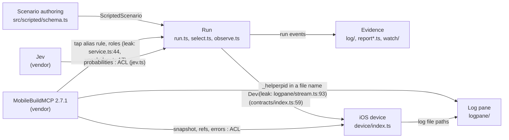
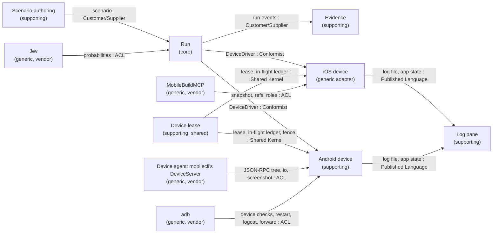
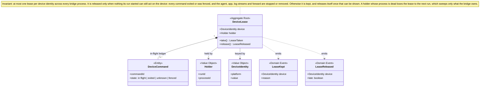
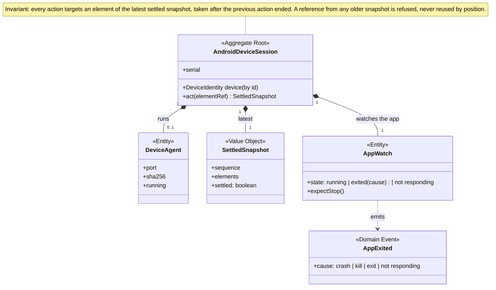

# Domain model: the Android device layer, redesigned

Session of 2026-09-29 (`/ddd`), a redesign of the Android device layer on top of the accepted [v1.2.0 spec](release-spec.md). The owner accepted every recommendation, round by round. The [decision record](#decisions) lists them, and the spec now follows them.

**In one sentence:** the bridge never runs mobilecli. It copies mobilecli's on-device agent out of the pinned mobilecli program, checks it against a pinned SHA-256, starts it on the device with `adb`, and speaks JSON-RPC to it directly.

## Today

Today's map, drawn from the code at `745f1af` (facts only). Leaks of MobileBuildMCP knowledge outside its driver are marked.



## Target

Target map, as settled in this session. The Android device context is ours. mobilecli supplies only the device agent, and the bridge never runs mobilecli itself.



What moved:
- **The leaks end.** The tap alias rule and `bridgeRole` move into the iOS driver, and the log pane asks the driver whether the app is running instead of reading `_helperpid`.
- **Inside the code, the app's identity replaces `bundleId`.** No contract changes.
- **The device lease becomes one shared module.** It was code inside the iOS driver.
- **mobilecli's CLI and daemon leave the design.** Its agent stays, as a generic supplier behind an anti-corruption layer.

## Glossary

New and changed terms. `CONTEXT.md` carries them.

### Across contexts

**Device lease**:
A bridge process's exclusive, recorded hold on one device for one run, keyed by the device identity. When it's released, nothing the run started can still act on the device.
_Avoid_: lock

**Device name**:
What a scenario or setting uses to name a device: a simulator UDID, an adb serial, or an emulator's AVD name.

**Device identity**:
The stable identity a device name resolves to: the UDID for a simulator, the AVD name for an emulator, the serial for a phone. An emulator's serial isn't one, because it changes with start order.
_Avoid_: mobilecli ID, device ID

**Element reference** (changed):
A handle to one element in one snapshot, valid only for that snapshot. MobileBuildMCP issues it on iOS, and the device driver issues it on Android.

**Settled snapshot**:
A snapshot the settle rule accepted: it matched a capture taken at least 250 ms after the earlier one returned.

**Screen still changing**:
A step's mark when the settle rule's 3-second cap ran out; the run went on with the last snapshot.

**Shown value**:
What a text field displays after the bridge typed a typed value into it. It can legitimately differ from the typed value (formatting, password dots).

**Launch options**:
How the app under test is started: launch arguments on iOS, an activity and intent extras on Android.

### Android device

**Device layer** (Android):
The device agent plus `adb`. The bridge drives both itself.

**Device agent**:
The UI-automation program the bridge runs on an Android device to read its screen and act on it: mobilecli's agent, copied from the pinned mobilecli program and checked against a pinned SHA-256.
_Avoid_: DeviceServer, server, mobilecli

**Foreign agent**:
Another tool's UI-automation program holding the device, such as mobile-mcp's, mobilecli's own, or Appium's. Android allows only one at a time.

**Fence**:
Stopping the device agent and confirming it is gone, so that no agent command whose outcome was unknown can still take effect.

## Model

### Device lease



### Android device session



## Events

| Event | Emitted by | Carries | Consumed by | Then |
| --- | --- | --- | --- | --- |
| `LeaseTaken` | Device lease | device identity, whether a dead holder's leftovers were swept | Android device, Evidence | the session starts; `prepared` records `sweptLeftovers: true` on Android runs |
| `ForeignAgentFound` | Android device | device identity | Run | the run is refused: `DEVICE_BUSY` |
| `AgentStarted` | Android device | port, agent SHA-256 | Evidence | `prepared` records the SHA-256 |
| `AgentFenced` | Android device | device identity | Device lease | agent commands with unknown outcomes count as ended |
| `StopExpected` | Android device | none | App watch | the bridge's own force-stop isn't an app exit |
| `AppExited` | App watch | cause | Run, Log pane | a failing step reports `APP_EXITED` or `APP_NOT_RESPONDING`; the pane shows the app stopped |
| `ScreenSettled` / `ScreenStillChanging` | Android device | settled snapshot | Run | the next step uses it; `step` records `settled: false` on the cap |
| `TextTyped` | Android device | shown value | Run | `action` records `shownValue`; `report.json` lists it in `typedFields` |
| `LeaseKept` | Device lease | reason | Run | the run ends inconclusive with `CLEANUP_FAILED` |
| `LeaseReleased` | Device lease | whether late | nobody | a late release isn't recorded; the next run simply succeeds |

These are domain events, not new `run.jsonl` types. Each lands as a field inside an existing event, on Android runs only (Q5.1).

One Android run, where the order is the point:

```mermaid
sequenceDiagram
    participant Run
    participant Lease as Device lease
    participant Android as Android device
    participant Agent as Device agent
    participant Pane as Log pane
    participant Evidence

    Run->>Android: prepare(scenario)
    Android->>Lease: take(device identity)
    Lease-->>Android: LeaseTaken (sweeps a dead holder's agent and forward)
    Android->>Android: device checks; a foreign agent means DEVICE_BUSY
    Android->>Agent: push the verified agent, start it, forward a port
    Agent-->>Android: device.version = pinned SHA-256 (AgentStarted)
    Android->>Android: logcat and app watch from device time; force-stop (StopExpected); am start -W
    Android--)Pane: log file published
    Run->>Evidence: prepared (identity, serial, agent SHA-256)
    loop each step
        Run->>Android: observe
        Android->>Agent: device.dump.ui until settled
        Android-->>Run: settled snapshot
        Run->>Android: act(reference from that snapshot)
        Android->>Agent: device.io.* request
        Android-->>Run: settled snapshot or screen still changing, shown value
        Run->>Evidence: step and action events
    end
    Note over Android,Run: AppExited is held by the app watch; the run reads it through appRunning()
    Run->>Android: close
    Android->>Android: wait for finite adb commands; force-stop (StopExpected); stop both logcat streams
    Android->>Agent: kill, then confirm it is gone (AgentFenced)
    Android->>Android: remove the forward
    Android->>Lease: release
    Lease-->>Android: LeaseReleased, or LeaseKept (CLEANUP_FAILED)
    Run->>Evidence: verdict
```

## Decisions

All accepted by the owner on 2026-09-29.

| # | Question | Decision |
| --- | --- | --- |
| Q1.1 | What "re-design mobilecli" means | **(b2):** drop mobilecli's CLI and daemon; copy its agent out of the pinned program, check it against a pinned SHA-256, and drive it directly |
| Q1.2 | Subdomains | Core: the run. Supporting: authoring, evidence, log pane, Android device. Generic: MobileBuildMCP, Jev, the device agent, adb |
| Q1.3 | How far phases 2–9 may move | Re-derive every phase; keep every Answer and decision A–F unless the redesign breaks it, and name each break |
| Q1.4 | iOS | Also move `bridgeRole` into the iOS driver, and use the app's identity instead of `bundleId` in code; no contract change |
| Q2.1 | Android: one context or two | One context with internal modules |
| Q2.2 | Who owns the lease | A shared module both drivers use |
| Q2.3 | When the agent is copied | At run time, into a private owner-only folder named by its SHA-256, checked every run; a mismatch is `ANDROID_TOOLS_UNAVAILABLE` |
| Q2.4 | Another tool's agent on the device | Refuse with `DEVICE_BUSY`; kill only the bridge's own leftover agent |
| Q2.5 | What the redesign voids | Decision B, ticket 01's lifecycle rules, the fleet, token and keychain guards, open point 21, and the guarded mobilecli wrapper; ADR-0006's draft is rewritten |
| Q3.1–Q3.4 | Language | Device lease, device name and identity, device agent and foreign agent, element reference redefined |
| Q3.5 | Gemini's vision-action loop | Out of scope for 1.x |
| Q3.6 | Stop question | Go deep on the device lease and the Android run's lifecycle only |
| Q4.1 | Lease invariant | Released only when nothing the run started can still act on the device |
| Q4.2 | Fencing | Stopping the agent, confirmed, ends agent commands with unknown outcomes |
| Q4.3 | Session invariant | Every action targets the latest settled snapshot |
| Q4.4 | After a crash | The next run takes the lease and sweeps only what the bridge owns |
| Q5.1 | Where events are recorded | New fields inside existing run events, on Android runs only |
| Q5.2 | A checkpoint on a screen that never settled | Judge as usual, and mark the step |

## Facts checked in this session

- **Everything the bridge needs is a device agent call.** Read in mobilecli 1.0.14's source (commit `03be42d`) by a subagent:
  - the methods are `device.dump.ui`, `device.io.tap`, `device.io.swipe`, `device.io.keys`, `device.io.text`, `device.io.button`, `device.clipboard.set` and `.clear`, `device.screenshot` and `device.version` (`agents/android/java/DeviceServer.java:57-98`);
  - non-English text goes through the agent's clipboard, then `KEYCODE_PASTE` (`devices/android.go:976-987`);
  - there's no login or handshake, and each HTTP/1.1 connection carries one JSON-RPC request (`JsonRpcSocketServer.java:105-176`).
- **The agent is built into the mobilecli program** (`agents/agents.go:8-9`), not shipped as a separate file. Checked offline on 2026-09-29:
  - the npm packages `@mobilenext/mobilecli-darwin-arm64@1.0.14` and `-darwin-amd64@1.0.14` each contain exactly one valid Android DEX file;
  - it is 72,660 bytes, format `038`, and its Adler-32 and SHA-1 header checks both pass;
  - its SHA-256 is `0e0865d0617bc6e4abf0a7b24a956da1ca25cfc795c30d8e32c64eb0d1f6258f` on both.
- **The licence is unchanged.** There's no separate licence for the agent, so the root FSL-1.1-ALv2 applies.

## Coverage

**Draws:** the target state, beside the today map.
**Settled:** subdomains, contexts, language, integration, aggregates and events.
**Stopped:** at the stop question, `aggregates` and `events` were modelled only for the device lease and the Android device session. The core run, the iOS device, evidence and the log pane were not modelled in depth, because the redesign doesn't change them.
**Inferred:** these were taken on my recommendation for supporting contexts and accepted in bulk, not argued one by one:
- the element mapping stays in the Android device context;
- `capture` isn't a run;
- the terms settled snapshot, screen still changing, shown value and launch options;
- the integration patterns on the target map;
- an app crash after the last checkpoint is handled as on iOS;
- a late lease release goes unrecorded.

**Not yet verified:** starting the copied agent on a device without mobilecli, and detecting a foreign agent. Phase 4 opens with a tracer on the emulator that proves both, before any other Android work (spec, phase 4 item 0).
