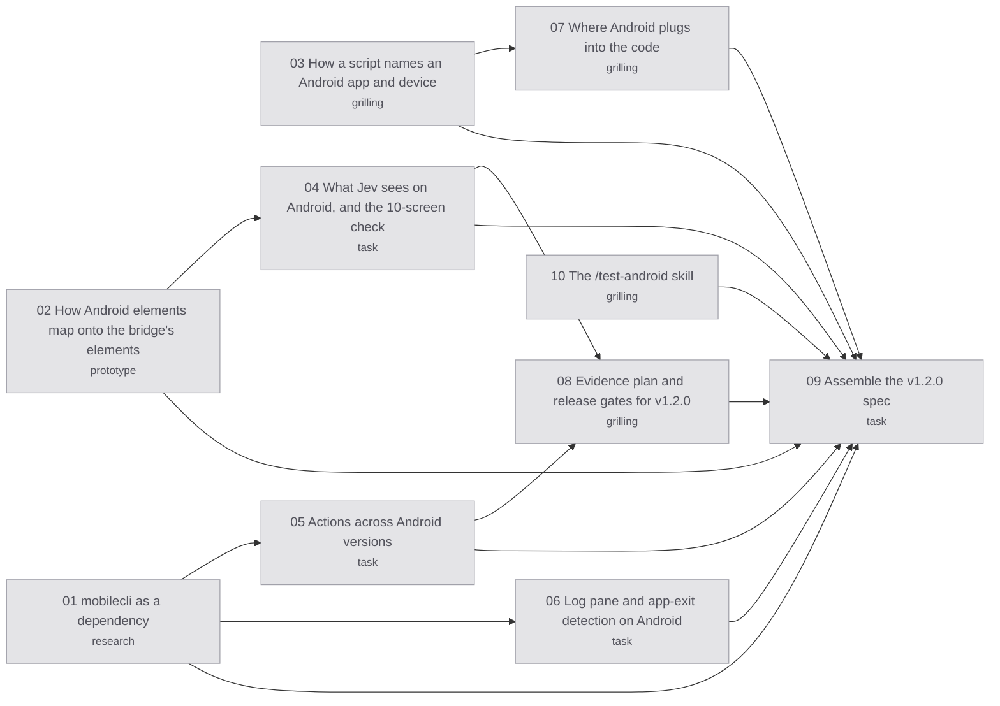

# Map: Android support for jev-ios-bridge

Label: wayfinder:map
Created: 2026-09-28

## Destination

A reviewed **v1.2.0 release spec for Android support**, written for Claude Code to execute, as the v1.0.0 spec was. It settles how the bridge drives Android emulators and phones through mobilecli, how scripts name an Android app and device, what Jev sees on Android screens, the evidence and release gates, and the docs. Android is additive: iOS scripts, reports and exit codes keep working under the 1.x contract.

## Notes

- **Domain:** agent tooling (MCP server, CLI, Claude Code plugin), Android automation through mobilecli (from mobile-mcp) plus `adb`, and TypeSafe Jev judgment. Vocabulary: [`CONTEXT.md`](../../CONTEXT.md) (now "Mobile Scenario Verification", with **Platform**). Design: [ADR-0002](../../docs/adr/0002-mobilebuildmcp-as-device-layer.md), [ADR-0004](../../docs/adr/0004-fixed-assertion-bounds-single-judgment.md), [ADR-0005](../../docs/adr/0005-the-1-0-stability-contract.md), [`docs/architecture.md`](../../docs/architecture.md).
- **Starting point:** the [research and emulator spike](plan.md). mobilecli runs the whole diagnostic flow on the emulator. It leaves an on-device `DeviceServer` that blocks other UI tools until it's killed.
- **Settled while charting (owner, 2026-09-28):**
  - **Destination:** a reviewed v1.2.0 spec, not the release itself. Claude Code executes it afterwards.
  - **Device layer:** an existing tool, mobilecli, called as a CLI and pinned like MobileBuildMCP. Its FSL-1.1 licence is accepted and gets an ADR. Plain `adb` is the fallback.
  - **Scripts:** an optional top-level `"platform": "android"`, with `app.package`, `device.serial` and optional `app.intentExtras`. iOS scripts are unchanged.
  - **Name:** `jev-ios-bridge` stays through 1.x, with a `/test-android` skill added. The rename waits for 2.0.
  - **Devices:** the spec covers emulators and real phones. v1.2.0 ships after the emulator checks; real phones are marked untested until the Xiaomi is free.
  - **Oldest Android version:** Android 12 (API 31).
  - **Evidence apps:** `examples/diagnostic-app-android`, the owner's `cmp` or `cmp-test` demo, and Settings as a light classic-View check.
  - **Jev check:** about 10 Android screens, one run.
  - **Non-English typing (owner, 2026-09-29):** in scope for v1.2.0, tested on the emulator, after "Actions across Android versions" showed mobilecli types it exactly. It was ruled out while charting. Jev's accuracy promise still covers English screens only.
  - **Delivery:** the map is charted on the local branch `spike/android-emulator` and merged in one PR together with the spike.
- **Devices and secrets:**
  - Use only the emulator `emulator-5554` (mobilecli calls it `Medium_Phone_API_36.1`), or another emulator you create.
  - Don't touch the Xiaomi `2985e9c` (another agent is using it) or BFSOne.
  - After any mobilecli use, stop its daemon (`mobilecli daemon stop`) and kill its device server (`adb shell pkill -f com.mobilenext.mobilecli.DeviceServer`), and remove its `adb forward`. mobilecli's first device lookup reads *every* connected phone, so experiments must hide the Xiaomi, for example with a private adb server on another port.
  - Load the Jev key from the main checkout's `.env` by path, as `AGENTS.md` says. Never print, copy or commit it.
- **Skills:** `grilling` and `domain-modeling` for grilling tickets; `prototype` for prototype tickets; `research` for research tickets; `typesafe:typesafe-ai` for anything touching Jev; `codebase-design` for seams; `compose-multiplatform-ui` for Compose semantics; `unslop` before anything people read.
- **Tracker:** local markdown ([`docs/agents/issue-tracker.md`](../../docs/agents/issue-tracker.md)). Refer to tickets by name. After opening, claiming, closing or rewiring a ticket, run `python3 scripts/render-route.py .scratch/android-support`.

## Decisions so far

- [Domain model: the Android device layer, redesigned](domain-model.md) (2026-09-29, after the map closed): the bridge never runs mobilecli. It drives mobilecli's device agent directly ([ADR-0006](../../docs/adr/0006-mobilecli-device-agent-as-android-device-layer.md)), with one device lease shared by both platforms and the fence. It amends "mobilecli as a dependency", "How a script names an Android app and device" and "Actions across Android versions", and the spec follows it.
- [Assemble the v1.2.0 spec](issues/09-assemble-the-spec.md): [the v1.2.0 release spec](release-spec.md) is written, reviewed by a fresh agent, and accepted by the owner, with six owner decisions and 21 open-point defaults. **The destination is reached.**
- [The /test-android skill](issues/10-the-test-android-skill.md): a separate, self-contained `/test-android` skill (`/test-ios` untouched); a new `jev-ios-bridge capture` command shows authors the elements exactly as selectors and Jev see them, and cleans up the device; the skill asks for `testTagsAsResourceId` but never edits the app.
- [Evidence plan and release gates for v1.2.0](issues/08-evidence-plan-and-release-gates.md): six Android scripts with planted pass, fail and inconclusive results on Android 16, three repeated on Android 12 including Vietnamese typing, a live crash run, a cleanup gate after every run, iOS benchmarks re-run, real phones marked untested with a Xiaomi checklist, an Android-only plugin install, and speed reported without a target.
- [Where Android plugs into the code](issues/07-where-android-plugs-into-the-code.md): one platform switch in `src/device/` builds the driver; new code in `src/device/android/`, sharing only locks and log tails with iOS; the tap alias rule moves onto the iOS driver; one Jev renderer with a per-platform header and rule; password values show as dots; `logSources()` gains `logcat`; golden tests from the 10 captures; device reason codes shared, with their wording broadened.
- [Log pane and app-exit detection on Android](issues/06-log-pane-and-app-exit.md): the pane follows one `adb logcat --uid` stream written to a private file, which works on Android 12 too; a second stream of system process events keeps `appRunning()` synchronous and catches crashes behind a dialog; a frozen app gets a new reason code, `APP_NOT_RESPONDING`. [Findings](findings/06-log-pane.md).
- [Actions across Android versions](issues/05-actions-across-android-versions.md): replace text with `ctrl+a`, a pause, then backspace; type with mobilecli `io text`, which is exact, including non-English text; tap by coordinates; read the full tree from mobilecli's on-device agent, to keep the `scrollable` and `password` flags; swipe from 90% to 10% over 1 s; a settle rule after every action (two matching captures ≥250 ms apart, 3 s cap). Non-English typing is now in scope. [Findings](findings/05-actions.md).
- [What Jev sees on Android, and the 10-screen check](issues/04-what-jev-sees-on-android.md): Android passes (31 claims on 10 screens, plain claims 18 right, 2 uncertain, 0 wrong) once an empty field's hint is shown as `placeholder`, which fixed the one confidently wrong answer; view rule `android-full-text-v1` with an Android header and the iOS fields.
- [How a script names an Android app and device](issues/03-script-and-device-identity.md): `"platform": "android"` with a required `app.package` (Android's naming rule), optional `app.activity` and string-only `app.intentExtras`, and `launchArgs` rejected; the device is `device.serial` or `device.avd`, else `JEV_ANDROID_DEVICE`, else `NO_DEVICE`; the plugin's simulator setting becomes optional; restart with force-stop then `am start -W`; refuse unauthorized, unbooted, locked or app-missing devices, and only wake a dark screen.
- [How Android elements map onto the bridge's elements](issues/02-android-element-mapping.md): roles from the Android class or Compose's role-marker child; a blank button takes its first inner text as its label, and that text stays in Jev's view but can't be selected; system bars and empty layout boxes are dropped; full resource-ids; switches are `0`/`1`; no new roles. Prototype on branch `prototype/android-element-mapping`.
- [mobilecli as a dependency: pinning, shipping, telemetry, and lifecycle](issues/01-mobilecli-as-a-dependency.md): pin `mobilecli@1.0.14` and run its binary directly; no telemetry, and the keychain and cloud fleet are turned off by flags and env; a private `MOBILECLI_HOME` per bridge process; `close` stops the daemon, kills the `DeviceServer`, and removes the `adb forward`; emulator IDs come from the AVD name. [Note](../../docs/research/mobilecli-dependency.md).

## Route

Green nodes are the frontier (open and unblocked), blue are claimed, grey are resolved, and white are blocked. `scripts/render-route.py` generates this block, so don't edit it by hand.

<!-- route:start -->

<!-- route:end -->

## Not yet specified

Nothing left in the fog: every remaining question is a ticket.

## Out of scope

- **One script for both platforms:** each script targets one platform.
- **CI and headless emulator farms.**
- **Building, installing or seeding apps:** the same rule as iOS.
- **Renaming the package:** that waits for 2.0.
- **BFSOne as evidence.**
