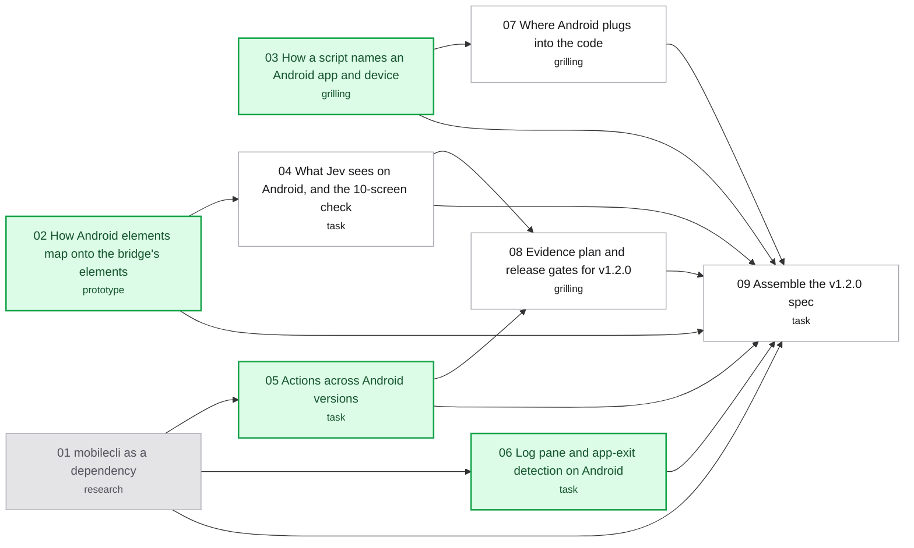

# Map: Android support for jev-ios-bridge

Label: wayfinder:map
Created: 2026-09-28

## Destination

A reviewed **v1.2.0 release spec for Android support**, written for Claude Code to execute, as the v1.0.0 spec was. It settles how the bridge drives Android emulators and phones through mobilecli, how scripts name an Android app and device, what Jev sees on Android screens, the evidence and release gates, and the docs. Android is additive: iOS scripts, reports and exit codes keep working under the 1.x contract.

## Notes

- **Domain:** agent tooling (MCP server, CLI, Claude Code plugin), Android automation through mobilecli (from mobile-mcp) plus `adb`, and TypeSafe Jev judgment. Vocabulary: [`CONTEXT.md`](../../CONTEXT.md) (now "Mobile Scenario Verification", with **Platform**). Design: [ADR-0002](../../docs/adr/0002-mobilebuildmcp-as-device-layer.md), [ADR-0004](../../docs/adr/0004-fixed-assertion-bounds-single-judgment.md), [ADR-0005](../../docs/adr/0005-the-1-0-stability-contract.md), [`docs/architecture.md`](../../docs/architecture.md).
- **Starting point:** the [research and emulator spike](plan.md). mobilecli runs the whole diagnostic flow on the emulator. It leaves an on-device `DeviceServer` that blocks other UI tools until it's killed.
- **Settled while charting (owner, 2026-09-28):**
  - **Destination:** a reviewed v1.2.0 spec, not the release itself. Claude Code executes it afterwards.
  - **Device layer:** an existing tool, mobilecli, called as a CLI and pinned like MobileBuildMCP. Its FSL-1.1 licence is accepted and gets an ADR. Plain `adb` is the fallback.
  - **Scripts:** an optional top-level `"platform": "android"`, with `app.package`, `device.serial` and optional `app.intentExtras`. iOS scripts are unchanged.
  - **Name:** `jev-ios-bridge` stays through 1.x, with a `/test-android` skill added. The rename waits for 2.0.
  - **Devices:** the spec covers emulators and real phones. v1.2.0 ships after the emulator checks; real phones are marked untested until the Xiaomi is free.
  - **Oldest Android version:** Android 12 (API 31).
  - **Evidence apps:** `examples/diagnostic-app-android`, the owner's `cmp` or `cmp-test` demo, and Settings as a light classic-View check.
  - **Jev check:** about 10 Android screens, one run.
  - **Delivery:** the map is charted on the local branch `spike/android-emulator` and merged in one PR together with the spike.
- **Devices and secrets:**
  - Use only the emulator `emulator-5554` (mobilecli calls it `Medium_Phone_API_36.1`), or another emulator you create.
  - Don't touch the Xiaomi `2985e9c` (another agent is using it) or BFSOne.
  - After any mobilecli use, stop its daemon (`mobilecli daemon stop`) and kill its device server (`adb shell pkill -f com.mobilenext.mobilecli.DeviceServer`), and remove its `adb forward`. mobilecli's first device lookup reads *every* connected phone, so experiments must hide the Xiaomi, for example with a private adb server on another port.
  - Load the Jev key from the main checkout's `.env` by path, as `AGENTS.md` says. Never print, copy or commit it.
- **Skills:** `grilling` and `domain-modeling` for grilling tickets; `prototype` for prototype tickets; `research` for research tickets; `typesafe:typesafe-ai` for anything touching Jev; `codebase-design` for seams; `compose-multiplatform-ui` for Compose semantics; `unslop` before anything people read.
- **Tracker:** local markdown ([`docs/agents/issue-tracker.md`](../../docs/agents/issue-tracker.md)). Refer to tickets by name. After opening, claiming, closing or rewiring a ticket, run `python3 scripts/render-route.py .scratch/android-support`.

## Decisions so far

- [mobilecli as a dependency: pinning, shipping, telemetry, and lifecycle](issues/01-mobilecli-as-a-dependency.md): pin `mobilecli@1.0.14` and run its binary directly; no telemetry, and the keychain and cloud fleet are turned off by flags and env; a private `MOBILECLI_HOME` per bridge process; `close` stops the daemon, kills the `DeviceServer`, and removes the `adb forward`; emulator IDs come from the AVD name. [Note](../../docs/research/mobilecli-dependency.md) on branch `research/mobilecli-dependency`.

## Route

Green nodes are the frontier (open and unblocked), blue are claimed, grey are resolved, and white are blocked. `scripts/render-route.py` generates this block, so don't edit it by hand.

<!-- route:start -->

<!-- route:end -->

## Not yet specified

- **Guide pages:** what an Android setup page covers (`testTagsAsResourceId`, emulator settings, the Xiaomi input setting, `pm grant` for permission dialogs), and how the limits page and quickstart change. This clears once the element mapping, script shape and actions are settled.
- **The `/test-android` skill:** how much it shares with `/test-ios`, and how it captures a screen while authoring (mobilecli directly, or a bridge command).
- **Speed:** whether v1.2.0 needs a speed target, or only reports the numbers. Typing ran at about 0.28 s per character in the spike.
- **Contract additions in detail:** the exact new reason codes, roles and report fields. This follows from the mapping, script shape and actions tickets.

## Out of scope

- **Non-English typing** (for example Vietnamese): it needs a helper app on the device.
- **One script for both platforms:** each script targets one platform.
- **CI and headless emulator farms.**
- **Building, installing or seeding apps:** the same rule as iOS.
- **Renaming the package:** that waits for 2.0.
- **BFSOne as evidence.**
