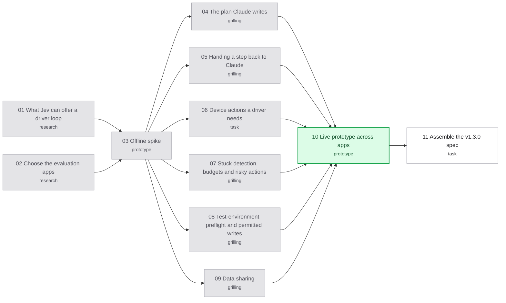

# Map: Jev drives the device

Label: wayfinder:map
Created: 2026-10-01

## Destination

A reviewed **v1.3.0 spec for a "driven" run mode** that any developer can use on their own app, written for Claude Code to execute:

- Claude prepares the app and submits a small validated plan: steps with intents, visible "done when" evidence, inputs and permitted effects. Scripted and Jev-driven steps can mix.
- The bridge builds the possible actions from each screen; Jev chooses routine ones; the bridge executes and checks them.
- Claude handles what Jev shouldn't: low confidence, unexpected dialogs, destructive actions, screens Jev can't read. The bridge keeps the device, records every hand-back and plan revision, and owns a UI-evidence verdict.
- The skill or prompt picks the platform. Driven mode opens on each platform only after it passes that platform's gate; scripted runs keep working everywhere.

The spec is only written if the offline spike (ticket 03) and the live prototype (ticket 10) pass. A no-go closes the map toward Claude driving through an interactive mode.

## Notes

- **Why (owner, 2026-10-01):** Jev is the cheap model, so Jev should control the simulator or device, not Claude. Claude guides and reads the report. Every proposal is judged by whether it moves step-by-step decisions from Claude to Jev. See the live-test plan's "main purpose" section: [`../live-test-v1.2/plan.md`](../live-test-v1.2/plan.md).
- **For other developers, not only the owner's app (owner, 2026-10-01):** the owner's app is one test case. Evaluations use unrelated apps, including one maintained outside this repo, and are reported per app and platform.
- **History, read first:** this was v0.1's design ([ADR-0001](../../docs/adr/0001-bridge-perceives-and-acts-jev-decides.md)). Three experiments picked the right next action 15/20, 16/20, 17/20 against a bar of 18/20, failing on premature "done" on unsaved forms, wrong scroll direction and duplicate rows. [ADR-0003](../../docs/adr/0003-explicit-scripts-with-jev-assertions.md) switched to scripts. What's different now: Claude supplies a step plan (Jev grounds steps, doesn't plan), Jev's "done" never advances a step alone, and an explicit, reported hand-back to Claude replaces "no fallback".
- **What Jev can do** ([TypeSafe research](research/typesafe-capabilities.md), [Claude + Jev orchestration](research/claude-jev-orchestration.md)): text only, no images; Choice (1 of ≤255 options, with confidence), Score, Noul; no free text, so typed values come from the plan; stateless, so the bridge resends context each call. Choice confidence is answer concentration, not a success rate, so thresholds are measured against labels. TypeSafe's "confidence-gated routing" pattern is this design.
- **Owner's Gemini research** (`~/Desktop/Điều khiển iOS app bằng AI Agent.pdf`): a vision model reading screenshots and writing `tap(x,y)` / `type_text`. Jev can't do either; we keep the loop with Jev choosing among bridge-built actions. Useful from it: WDA for a physical iPhone (separate effort), settle time, a back action.
- **Code seams:** `DeviceDriver` (`src/contracts/index.ts:105-128`) is shared and reusable; `runScriptedScenario` (`src/scripted/run.ts:174-418`) has no "decide next" hook; actions are only tap, type, swipe-in-element; the watch page already renders `choice`/`confidence`/`goalReached` (`src/watch/index.ts:22`), unused since v0.1.
- **Decisions, first session (with Claude, 2026-10-01), Q42–Q46:**
  - Q42: reopen "Jev drives" as the hybrid: Claude's plan, Jev drives, Claude steps in.
  - Q43: first step is an offline spike, no device.
  - Q44: success needs zero confident wrong picks and Jev handling ≥ 70% (made precise by C3, C12, C29).
  - Q45: physical iPhone (WDA) is a separate effort after this one.
  - Q46: don't wait for Jev image input; design around text.
- **Decisions, second session (with Codex, 2026-10-01), C1–C29** (transcript: `~/.codex/sessions/2026/10/01/rollout-2026-10-01T15-29-31-*.jsonl`):
  - **Gates:** the offline spike authorizes a live prototype only (C1). Count every decision and hand-back; compare completed flows, wrong actions, total Claude + Jev cost and time against v1.2 scripts and Claude driving directly (C3). Report per app and platform (C12). Cost target fixed after baselines, before the driven trial: ≥ 50% lower total model cost than Claude driving directly, no correctness loss (C13). Release gate per platform on a fresh cross-app sample: per app ≥ 60 accepted Jev actions, zero wrong accepted actions, zero false PASS, complete live flows, ≥ 70% Jev-handled, ≥ 50% cost saving; state-changing actions reported separately (C29).
  - **Scope:** for any developer (C4); platform chosen by skill or prompt, staged per platform, scripted mode stays (C5, C10); Claude prepares unfamiliar apps from project instructions, the bridge checks the installed app and starting screen (C6); multiple unrelated apps incl. one outside this repo (C9); the offline spike already uses unrelated apps (C11).
  - **Safety:** autonomous writes need a project-supplied, machine-checkable preflight that fails closed, plus an explicit permitted-effect step (C2, C7, C14); Jev never grants permissions or dismisses unexpected dialogs (C17); destructive actions always go to Claude; permitted test writes use a stricter threshold (C21); driven mode needs a project opt-in for sending screen text, local-only steps and project screen rules (C18, C24).
  - **Run behaviour:** Jev's "done" never advances a step alone; visible evidence is checked on a fresh screen (C4 of round 1); screens Jev can't read go to Claude with the screenshot (C8); the bridge keeps the device lease during hand-backs and Claude acts through MCP (C15); Claude may revise remaining steps, recorded (C16); a Claude-only coordinate tap (C19); a small structured plan (C20); scripted and driven steps mix (C23); restart by default, attach as an option (C25).
  - **Verdicts:** the bridge owns the recorded verdict; Claude's view is separate (C22); a wrong turn ends `INCONCLUSIVE` after a bounded hand-back, `FAILED` only on a visible contradiction at a valid check (C26); the expected result comes from the developer's request, spec or tests (C27); the verdict is UI evidence, persistence shown by reopening the record (C28).
- **Build handed to Claude (owner, 2026-10-01), D0–D4:** spike labels approved with the owner's app dropped (the tool must not depend on any one app); build the real code behind an "experimental" switch instead of a throwaway prototype (ticket 10 runs on it); the build starts only after the spike says go; orchestration = one Claude Code instance per Issue in Orca, feature branch `agent/jev-drives-v1.3`; Claude may merge Issues into the feature branch and open the PR, the owner merges to main, tags and publishes.
- **How Jev returns to Claude (core of ticket 05):** an MCP server can't call Claude, but Claude polls `get_report` (waits ≤ 45 s). The bridge pauses the run, keeps the device lease, and the waiting call returns at once with a "needs Claude" package (reason, step, screen text, screenshot, Jev's top picks). Claude answers with one tool call (an action, a plan revision, or stop); the bridge acts, checks, and Jev resumes. No answer in time → `INCONCLUSIVE`, lease released.
- **Related, not in this map:** live-test issues [01 show the simulator window](../live-test-v1.2/issues/01-show-the-simulator-window.md) and [02 typed values from env vars](../live-test-v1.2/issues/02-typed-values-from-environment-variables.md), both ready-for-agent. The live test's Phase B is paused; its method becomes ticket 10's baseline.
- **Devices and secrets:** leave the the owner's phone `<serial>` alone unless the owner says. the owner's app SM data is the test DB (a test tenant). Load the Jev key by path per `AGENTS.md`; never print it.
- **Skills:** `typesafe:typesafe-ai` for anything Jev; `prototype` for spikes; `research` for ticket 02; `grilling` for design tickets; `codebase-design` for seams; `unslop` before anything people read.
- **Tracker:** local markdown ([`docs/agents/issue-tracker.md`](../../docs/agents/issue-tracker.md)). After opening, claiming, closing or rewiring a ticket, run `python3 scripts/render-route.py .scratch/jev-drives`.

## Decisions so far

- **Design batch E1–E15 (owner, 2026-10-01), resolving tickets 04–09:** script version 2 with a `do` step (intent, doneWhen, effect, values, localOnly), restart or attach; new MCP tool `resolve_step`, `get_report` returns `needs_claude`, 5-minute pause limit, `decidedBy` on every action; back (Android key, iOS nav button or edge swipe), scroll, Claude-only `tapAt`; bridge-owned target search (3 down, 3 up), stuck rules, 8 Jev decisions per step, risky-word net; `.jev/preflight.json` before Jev writes; `.jev/config.json` opt-in plus experimental switch, local-only steps and screen rules; live-test issues 01 and 02 join the build. Next: [build spec](build/spec.md).
- [Offline spike](issues/03-offline-spike-can-jev-ground-a-step.md): one run, 0 wrong accepted picks, 18/22 (82%) Jev-handled, but NO-GO under the per-app rule (3 apps short on 2–3 cases each; 3 of 4 misses were off-screen targets Jev never scrolled to). **Owner override 2026-10-01: proceed to the build**, with code-owned target search added to ticket 07 and proven on new cases in ticket 10. [Results](../../spikes/jev-drives/results/results.md).
- [Choose the evaluation apps](issues/02-choose-the-evaluation-apps.md): spike on the owner's app, KotlinConf, NetNewsWire, ReadMe, Now in Android, Fossify Calendar, ListMaker, plus Weather/Apple screens; release gate on 3 apps per platform (iOS the owner's app, NetNewsWire, KotlinConf; Android the owner's app, Now in Android, Fossify Calendar); KotlinConf read-only; Apple apps are extra screens only. [Research](research/evaluation-apps.md).
- [What Jev can offer a driver loop](issues/01-what-jev-can-offer.md): Choice over bridge-built options is the fit; no free text, no images, no memory; confidence-gated routing is TypeSafe's own pattern. [Research](research/typesafe-capabilities.md), [orchestration](research/claude-jev-orchestration.md).

## Route

<!-- route:start -->

<!-- route:end -->

## Not yet specified

- Report format for a driven run (who chose each action, hand-backs, revisions, Claude's cost).
- The skill text that teaches Claude to write plans and handle hand-backs.

## Out of scope

- Image input to Jev (Q46).
- Physical iPhone through WDA (Q45, its own effort).
- A coordinate-based vision loop as in the Gemini research; coordinates are Claude-only (C19).
