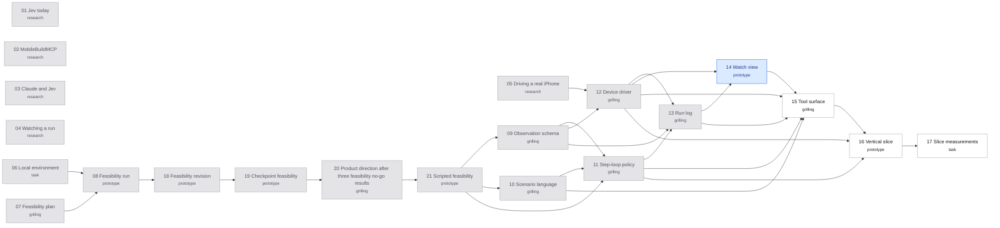

# Map: jev-ios-bridge

Label: wayfinder:map
Created: 2026-09-21 · Re-charted: 2026-09-25

## Destination

A verified implementation and GitHub prerelease v0.1.0 of the bridge, including its installable package, tools, run loop, observation, policy, report, and watch view. The owner expanded the planning effort through release on 2026-09-24. Measured feasibility evidence, the reviewed corpus, and the go/no-go decision remain gates; implementation must not turn missing evidence into a resolved ticket.

## Notes

- **Domain:** agent tooling (Claude Code MCP servers and skills), iOS simulator automation through MobileBuildMCP, and TypeSafe Jev.
- **Settled while re-charting on 2026-09-24**, from the research tickets and a grilling session with the owner:
  - **Why the bridge exists.** The host submits one complete script and reads one report, without receiving screens step by step. The bridge executes the script; Jev judges checkpoint assertions. Lower cost remains a measurement question.
  - **The bridge owns scripted execution** ([ADR-0003](../../docs/adr/0003-explicit-scripts-with-jev-assertions.md)), accepted after the assertion and real-execution gates. ADR-0001’s autonomous action design failed three experiments and is superseded.
  - **Claude Code is the first-class host.** Codex is supported on a best-effort basis.
  - **Device layer:** `mobilebuildmcp@2.7.1` ([ADR-0002](../../docs/adr/0002-mobilebuildmcp-as-device-layer.md)).
  - **Stack:** TypeScript on Node 24, using `@typesafe-ai/sdk`. "Tool surface: tools, report format, and /test-ios" picks the MCP SDK line.
- **Read before any ticket:** [`CONTEXT.md`](../../CONTEXT.md), the ADRs, and [`docs/architecture.md`](../../docs/architecture.md). The evidence is in [`docs/research/`](../../docs/research/).
- **Skills:**
  - `typesafe:typesafe-ai` for anything touching Jev (read the live docs);
  - `grilling` and `domain-modeling` for grilling tickets;
  - `prototype` for prototype tickets;
  - `codebase-design` when a ticket shapes a module seam;
  - `mermaid-diagrams` for diagrams;
  - `unslop` before anything reviewers read.
- **Tracker:** local markdown; see [`docs/agents/issue-tracker.md`](../../docs/agents/issue-tracker.md). Refer to tickets by name. After opening, claiming, closing, or rewiring a ticket, run `python3 scripts/render-route.py`.
- **Reaching the destination:** consolidate decisions into the spec, implement and verify the bridge, review the changes, then publish the GitHub prerelease. The main agent owns integration and ticket updates; delegated agents own explicitly assigned files. External messages to engineers are not part of the release authorization.

## Decisions so far

- [Second feasibility run](issues/18-feasibility-revision.md): also no-go, with 16/20 correct, 14/20 accepted, and two accepted errors. [Checkpoint feasibility](issues/19-checkpoint-feasibility.md) now tests explicit observable subgoals while keeping the same success bar and autonomous bridge-owned execution.

- [First feasibility run](issues/08-feasibility-run.md): no-go. Filtered full observations with history and threshold 0.9 produced 15/20 correct actions and 7/20 accepted cases, with no accepted errors or false-pass assertions. [A revision](issues/18-feasibility-revision.md) must meet the same bar on fresh held-out cases before production design proceeds.

- [Local environment](issues/06-local-environment.md): dedicated iOS 26.4 simulator is ready, pinned MobileBuildMCP captures work, and the supplied key authenticates. Settings, Contacts, Reminders, and Files are available; Apple Weather was unavailable; the pinned Sentry Weather fixture was subsequently built and installed.

- [Jev today: model, API, SDK, limits](issues/01-jev-today.md): `jev-1.13.0` is text-only and stateless. A request is capped at 64k tokens, with 32k for the state plus the longest question. Noul answers carry no confidence. TypeSafe publishes no cookbook for choosing UI actions.
- [MobileBuildMCP: simulator and real-iPhone capability](issues/02-mobilebuildmcp-capability.md): the project was renamed on 2026-09-23. Element references expire after 60 s. Full snapshot data comes only from the CLI. There is no UI automation on a real iPhone.
- [Claude and Jev: dividing the work](issues/03-claude-and-jev.md): a tool call cannot ask Claude anything mid-run, and `structuredContent` hides the text report. The evidence leaves two shapes viable: a loop run by the bridge, or a loop run by a Claude subagent. The owner chose the bridge.
- [Watching a run: options for a live view](issues/04-watching-a-run.md): the Claude Code CLI shows one progress line, and MCP logging is deprecated. The practical watch view is a localhost page served from the run log.
- [Driving a real iPhone: what a second device layer takes](issues/05-driving-a-real-iphone.md): WebDriverAgent through Appium is the plausible path, sized M. Most of that cost is per-developer signing and keeping it working across Xcode releases. Jev's view of the screen can stay the same.
- [Domain boundaries](../../docs/domain-boundaries.md): one iOS Scenario Verification context owns the run and verdict policy. Preparation and evidence presentation are supporting modules; the integration patterns remain explicitly inferred.
- [Feasibility plan: the go/no-go bar and the step questions](issues/07-feasibility-plan.md): 30 owner-labelled cases, split into 10 tuning and 20 held-out cases. One Choice selects a complete action; independent Nouls check completion and assertions. Compare compact/full observations with/without history, then freeze one configuration. The exploratory bar is 18/20 correct choices, at least 16/20 accepted with no accepted errors, and no false-pass assertions. The environment and reviewed corpus still precede live evaluation.

- [Checkpoint feasibility](issues/19-checkpoint-feasibility.md): third no-go, 17/20 correct actions and 10/20 accepted, with no accepted errors or false-pass assertions. All original criteria remain unchanged. [Product direction](issues/20-post-feasibility-direction.md) records the owner-approved pivot to explicit scripts. [Scripted feasibility](issues/21-scripted-feasibility.md) passed its separate assertion and real-execution gates. The main agent accepted that architecture under the release delegation; installed-host and measurement checks still gate release.

- [Scripted feasibility](issues/21-scripted-feasibility.md): 22/24 true and 23/24 false claims confidently correct, zero confidently wrong judgments. Twelve real scripts matched their oracles; three fault probes stopped safely. Production integration passes 147 tests. The blind report-and-source diagnosis succeeded; installed-host testing and same-machine benchmarks are in progress.

## Route

Green nodes are the frontier (open and unblocked), blue are claimed, grey are resolved, and white are blocked. `scripts/render-route.py` generates this block, so don't edit it by hand.

<!-- route:start -->

<!-- route:end -->

## Not yet specified

- **Hooks:** Claude Code hooks that start a run automatically, for example after Swift edits. This depends on how long a run takes, which "Slice measurements: cost, speed, and diagnosis against the baseline" measures.
- **Distribution:** GitHub prerelease `v0.1.0` with an installable `jev-ios-bridge` npm tarball; no npm registry publication is planned.
- **Non-English screens:** Jev is documented to be less accurate on them.
- **Prompt injection:** screen text that steers Jev's answers, in apps that show user-written content.
- **Cost budget per run:** what a run may cost, once the feasibility and slice measurements give real numbers.

## Out of scope

- **Building real-iPhone support.** It needs a second device layer. "Driving a real iPhone: what a second device layer takes" sizes that work for a later effort.
- **A loop owned by the host agent**, whether in the main session or in a subagent. The bridge's value is one scenario submission per run (ADR-0001).
- **Running in CI or without a person.** v1 must not block it: scenarios are files, and a run needs no interactive host.
- **Codex parity.** Codex's 60 s default timeout, and the fact that it shows no progress, would force either start-and-poll tools or a per-user timeout override. Codex would also need a watch view outside the host.
- **A watch view built as an MCP App, or as an overlay inside the app under test.** MCP Apps do not render in the Claude Code CLI, and an overlay would change what Jev sees.
- **Simulator or UI automation code of our own**, whether over `simctl`, `idb`, or AXe directly (ADR-0002).
- **Sending screenshots to Jev.** Jev accepts text only.
