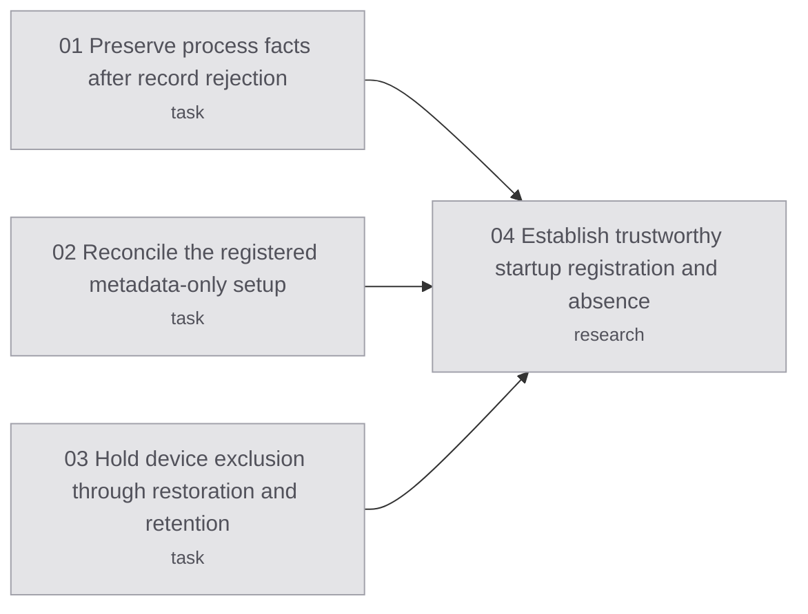

# Native owner recovery

## Destination

Preserve rejected-record process facts, dispose of the registered metadata setup through its separate ownership contract, and resume native research only when ordinary startup gates pass.

## Notes

Code landed in [PR 48](https://github.com/hugues-vnsgn/jev-ios-bridge/pull/48). Live recovery observed canonical absence and restored Shutdown. A later boot returned dangling runner metadata; fixed metadata refused before native execution. The reference study remains unrun. All 23 production requirements remain pending.

## Decisions so far

- [01](issues/01-process-accounting.md): independent process facts preserve the first stream refusal and original deadline.
- [02](issues/02-metadata-reconciliation.md): one source-bound case was reconciled once; original failure and unknown exit code remain unchanged.
- [03](issues/03-device-exclusion.md): the shared unknown-owner claim survives frontend exit and releases only after settled restoration.
- [Live evidence](evidence/2026-10-07/report.md): container lookup and installed-app listing agree on an old URL whose app and UUID directory are absent. Provider persistence cause remains unconfirmed.

- [04](issues/04-startup-registration-authority.md): choose two declared, separately bound study identities under the unchanged startup gate; [implementation](../native-study-identities/map.md) is supervisor-owned. No documented repair barrier was found.

## Route

<!-- route:start -->

<!-- route:end -->

## Not yet specified

Owner-supported startup registration/lifecycle authority, or a separately source-bound setup with concrete ownership and unchanged admission requirements. The consumed case cannot authorize another apply. Complete original ancestry, reference lifetime and native input consumption/contact release still lack applicable owner contracts.

## Out of scope

No production capability accepted. No shared-daemon reset, simulator registry deletion, cleanup replay, input or another simulator.
