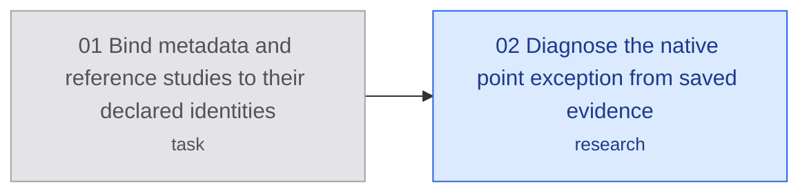

# Independently bound native studies

## Destination

Resume metadata and reference observations with two declared, source-bound app
identities on the same owned simulator, preserving all admission and ownership
requirements.

## Notes

Supervisor owns decisions and execution. The user need not choose a backend or
interpret a ticket. The historical deleted-app registration remains unresolved.

## Decisions so far

Choose independent metadata/reference identities; preserve the original
canonical absence gate and consumed case. No automatic identity rotation.

- [Bind metadata and reference studies](issues/01-bind-study-profiles.md): merged
  PR 50; both builds passed. Metadata completed and cleaned up. Reference reached
  the intended fixture but its first point lookup threw; it retains ownership.
  [Recorded evidence](evidence/2026-10-07/report.md).

## Route

<!-- route:start -->

<!-- route:end -->

## Not yet specified

Applicable native ancestry, reference lifetime and input consumption/contact
release contracts. Observations do not accept any of the 23 production tickets.

The [immediate investigation](issues/02-diagnose-point-exception.md) is the failed native point lookup and its caller
requirements, using saved evidence and provider sources. The supervisor owns
that diagnosis. Exception details were not captured; no cause is yet proven.
The reference device/apps/guard remain retained, so no further device work is
admitted by this effort.

## Out of scope

Old-case cleanup replay, shared-daemon reset, registry deletion, another
simulator, input, or a production checked-action driver.
