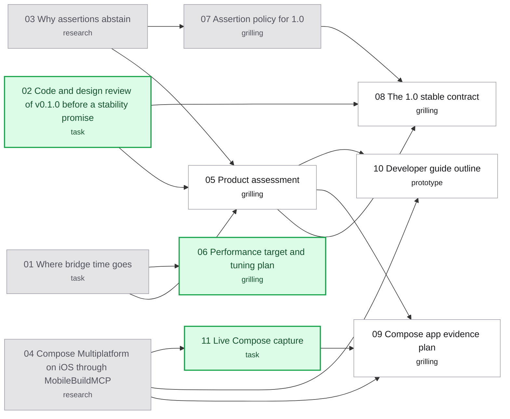

# Map: jev-ios-bridge v1.0.0

Label: wayfinder:map
Created: 2026-09-25

## Destination

A reviewed **v1.0.0 release spec**, handed off to Codex to execute. It records the go/no-go judgment on v0.1.0, the frozen 1.0 contract, the assertion policy, the performance target and tuning plan, the Compose Multiplatform evidence plan, the developer guide outline, and the release gates. If the product assessment says no-go, the destination becomes another prerelease spec, not 1.0.

## Notes

- **Domain:** agent tooling (a Claude Code MCP server and skill), iOS simulator automation through `mobilebuildmcp@2.7.1`, and TypeSafe Jev assertion judgment. Vocabulary: [`CONTEXT.md`](../../CONTEXT.md); design: [ADR-0003](../../docs/adr/0003-explicit-scripts-with-jev-assertions.md), [ADR-0002](../../docs/adr/0002-mobilebuildmcp-as-device-layer.md), [`docs/architecture.md`](../../docs/architecture.md).
- **Starting point:** GitHub prerelease [v0.1.0](https://github.com/hugues-vnsgn/jev-ios-bridge/releases/tag/v0.1.0), shipped by Codex from the [previous map](../jev-ios-bridge/map.md). Its measured results are in [`docs/research/scripted-benchmarks.md`](../../docs/research/scripted-benchmarks.md) and its limits in [`docs/releases/v0.1.0.md`](../../docs/releases/v0.1.0.md).
- **Settled while charting (owner, 2026-09-25):**
  - **Release form:** v1.0.0 as a regular GitHub release with the tarball; no npm registry.
  - **Plan, don't do:** this map ends at the release spec. **Codex executes it**, so the spec is written for an agent reader.
  - **Judgement covers three things:** Jev assertion quality, an honest product assessment, and a code/design review.
  - **The product assessment is a go/no-go gate** for a 1.0 stability promise.
  - **The 1.0 stability promise covers** a versioned script format, MCP tools plus CLI and exit codes, verdict semantics (the 0.9/0.1 bounds and pass/fail/inconclusive rules), and the report and evidence layout.
  - **Performance:** profile first, then set a numeric target from what is actually removable.
  - **Required new evidence:** one Kotlin Multiplatform / Compose Multiplatform iOS app.
  - **Docs audience:** native iOS developers (SwiftUI/UIKit) using Claude Code, plus KMP/Compose Multiplatform apps. Markdown in the repo, shipped in the tarball.
  - **Codex as a host stays best effort.**
- **Known performance lead:** every device command spawns `npx --yes mobilebuildmcp@2.7.1` (`src/device/index.ts`, `defaultRunner`). In the Weather run, observe plus act took 100.5 s of 107.7 s of prepared execution; Jev judgment took 3.5 s.
- **Skills:** `grilling` and `domain-modeling` for grilling tickets; `prototype` for prototype tickets; `research` for research tickets; `typesafe:typesafe-ai` for anything touching Jev; `codebase-design` for seams; `compose-multiplatform-ui` and `kmp-ios-integration` for Compose tickets; `code-review` for the review ticket; `unslop` before anything people read.
- **Device and secrets:** one agent at a time owns device operations, on the dedicated simulator `0E42FDE2-5E09-42D3-9876-9EF0037FCBE7` only. Follow `AGENTS.md` for the `.env` Jev key: load it by path; never print, copy, or commit it.
- **Tracker:** local markdown ([`docs/agents/issue-tracker.md`](../../docs/agents/issue-tracker.md)). Refer to tickets by name. After opening, claiming, closing, or rewiring a ticket, run `python3 scripts/render-route.py .scratch/v1-release`.

## Decisions so far

- [Where bridge time goes](issues/01-where-bridge-time-goes.md): Jev is 3% of step time. `npx` adds ~0.5 s to every device command (~26% of recorded time), CLI startup ~0.33 s more, and each action already returns a settled capture that the bridge discards. Ranked options: resolved binary, capture reuse, concurrent screenshot, long-lived client. [Findings](../../docs/research/bridge-latency.md).
- [Assertion policy for 1.0](issues/07-assertion-policy.md): 0.9/0.1 fixed; a confidently false claim now fails even beside uncertain ones; one judgment per checkpoint, no re-asks; claim rules taught, not enforced; model pinned per release behind a corpus gate; observation-shape experiment runs before 1.0 ([ADR-0004](../../docs/adr/0004-fixed-assertion-bounds-single-judgment.md)).
- [Compose Multiplatform on iOS through MobileBuildMCP](issues/04-compose-multiplatform-on-ios.md): `testTag` maps to the accessibility identifier with no opt-in since CMP 1.8.0; recommend 1.12.1+ and unique tags on actionable nodes; no bridge change expected. Candidate app: Alkaa (pinned fork). [Findings](../../docs/research/compose-multiplatform-ios.md); nine questions await a live capture.
- [Why assertions abstain](issues/03-why-assertions-abstain.md): uncertainty comes from implicit evidence (empty fields, unprinted list ends, saved-state inference), not compound claims or truncation. Keep 0.9/0.1 and teach claim-authoring rules; no blind re-asks. [Findings](../../docs/research/assertion-uncertainty.md).

## Route

Green nodes are the frontier (open and unblocked), blue are claimed, grey are resolved, and white are blocked. `scripts/render-route.py` generates this block, so don't edit it by hand.

<!-- route:start -->

<!-- route:end -->

## Not yet specified

- **Release gates and the spec's assembly:** the checklist Codex must pass before tagging 1.0 (tests, re-run benchmarks, Compose evidence, clean install, docs walkthrough). Its shape depends on the contract, the performance target, and the evidence plan.
- **MobileBuildMCP drift under a stable promise:** what a MobileBuildMCP upgrade must pass before a 1.x release adopts it (capture shape, selector behavior, typing). The Jev side is settled in "Assertion policy for 1.0". This probably graduates out of the contract ticket.
- **Migrating 0.1.0 scripts:** whether an unversioned 0.1.0 script is accepted, upgraded, or rejected once the format carries a version.
- **Data-handling statement for outside developers:** what the guide must say about screen text going to TypeSafe and unredacted local screenshots before developers point this at real apps.
- **Cost budget per run:** carried over from the previous map; a number for the docs once tuning changes the measurements.
- **Prompt injection through screen text:** carried over. The assessment decides whether 1.0 must address it or only document it.

## Out of scope

- **npm registry publication.** 1.0 ships as a GitHub release tarball (owner, 2026-09-25).
- **Executing the spec.** Implementation, measurement runs, and publishing belong to Codex after handoff.
- **Codex as a first-class host.** It stays best effort, as in v0.1.0.
- **A docs website.** Docs are repo markdown shipped in the package.
- **Selector guidance for React Native and Flutter apps.** The audience is native iOS plus KMP/Compose.
- **Real-iPhone UI automation, autonomous navigation, automatic hooks, and CI operation.** These were out of v0.1.0 and remain outside this effort.
