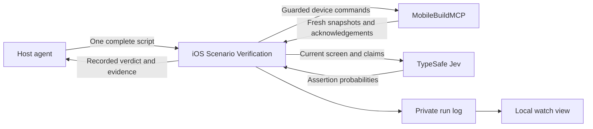

# jev-ios-bridge architecture

The bridge executes an authored script and asks Jev only to judge assertions. The assertion, real-execution, and installed-host gates passed; hardening, measurements and code review are complete, with the documented experimental limits. [ADR-0003](adr/0003-explicit-scripts-with-jev-assertions.md) records the change after three autonomous-action experiments failed.

## Context and authority

The run policy owns the verdict. Jev supplies probabilities; the device layer supplies captures and action results. The report and watch view present the recorded result. [Domain boundaries](domain-boundaries.md) keeps these responsibilities inside one context.

## One run

1. Validate the complete script, limits and credentials. Allocate a run log and acquire the dedicated device lease.
2. Restart the installed app through the pinned device layer. The simulator is already booted; persistent data is a setup precondition.
3. Capture the current screen before each step. Check distinguishing guards and resolve exactly one eligible target for an action. A missing, ambiguous, or unexpected state stops inconclusively.
4. Execute authored tap, text replacement or swipe actions, or poll a bounded wait. Use current references and require terminal acknowledgements. Fresh references never justify guessing after a changed screen.
5. At a checkpoint, project the current full accessibility capture and ask one Noul per claim. There is no Choice, completion question, future script, or value dictionary in the request.
6. Record the checkpoint result. Any uncertain claim yields inconclusive; otherwise any false claim fails. Passing requires all steps and checkpoints, followed by successful cleanup.
7. Stop the app, release the confirmed lease, and append the final verdict. Unknown device outcomes or cleanup failures retain the lease and prevent a pass.

The script has finite steps and global time/step budgets. It does not escalate to the host or resume an interrupted run. The host polls progress with bounded waits; running responses contain no screen evidence for selecting another action.

## Modules

| Module | Responsibility |
| --- | --- |
| `src/scripted/schema` | Strict scenario, guard, selector, value and step validation |
| `src/scripted/select` | Unique eligible target resolution and guard checks |
| `src/scripted/run` | Ordered execution, limits, checkpoint policy and cleanup |
| `src/scripted/observe`, `jev` | Frozen assertion projection, pinned SDK request and response validation |
| `src/device` | MobileBuildMCP commands, references, locks and acknowledged lifecycle |
| `src/log`, `src/scripted/report`, `src/watch` | Private evidence, report reconstruction and human viewing |
| `src/service`, `src/mcp`, `src/cli` | Job lifetime and public entrypoints |

Historical autonomous modules and experiments are retained for evidence and replay. The supported service/CLI/MCP path accepts scripts only.

## Identity and evidence

Selectors use durable descriptions rather than captured element refs. Generic matching is conservative. An internal MobileBuildMCP 2.7.1 opt-in recognizes exact-frame button aliases only where the pinned vendor generates identical tap commands; it does not extend to different positions or other actions. [The proof](../spikes/scripted/integration/tap-alias-equivalence.json) records this boundary.

TypeSafe receives visible screen text and current claims. Supplied values go to device actions and may subsequently appear in that text. Screenshots remain local. The journal redacts supplied values and the API key; image contents are not text-redacted. The watch view binds to localhost and requires its access token.

The run log stores decisive assertion observations and copied screenshots. Reports include claims, probabilities, semantic screen evidence and local pointers. Their text is bounded and marks truncation; complete local evidence remains available. An incomplete final JSONL record can be recovered, but an absent final verdict remains inconclusive.

## Validated limits

- Node 24+, pinned MobileBuildMCP 2.7.1, Jev 1.13.0 and SDK 0.6.0.
- Simulator-only UI execution; build/install/seed/reset are outside the bridge.
- At most 100 authored steps; default whole-run time 300 seconds, configurable up to one hour. Each wait is at most 60 seconds.
- Fixed Noul yes/no bounds 0.9/0.1. Uncertainty is visible and never promoted to a pass.
- Full observation cap 24,000 bytes; state plus longest question 28,000 bytes; total request 56,000 bytes. Overflow stops rather than silently removing evidence.
- Printable US-keyboard literals; no leading hyphen under the pinned typing limitation.

See [usage](usage.md), [the tracker](../.scratch/jev-ios-bridge/map.md), and [the release plan](../.scratch/jev-ios-bridge/release-plan.md) for setup, evidence and release verification.
