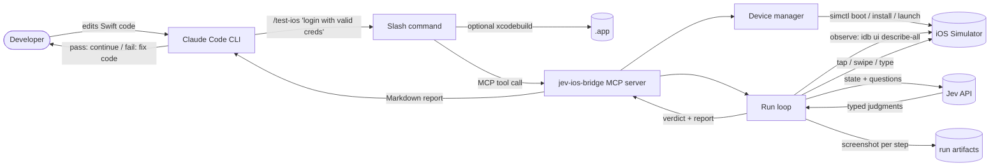
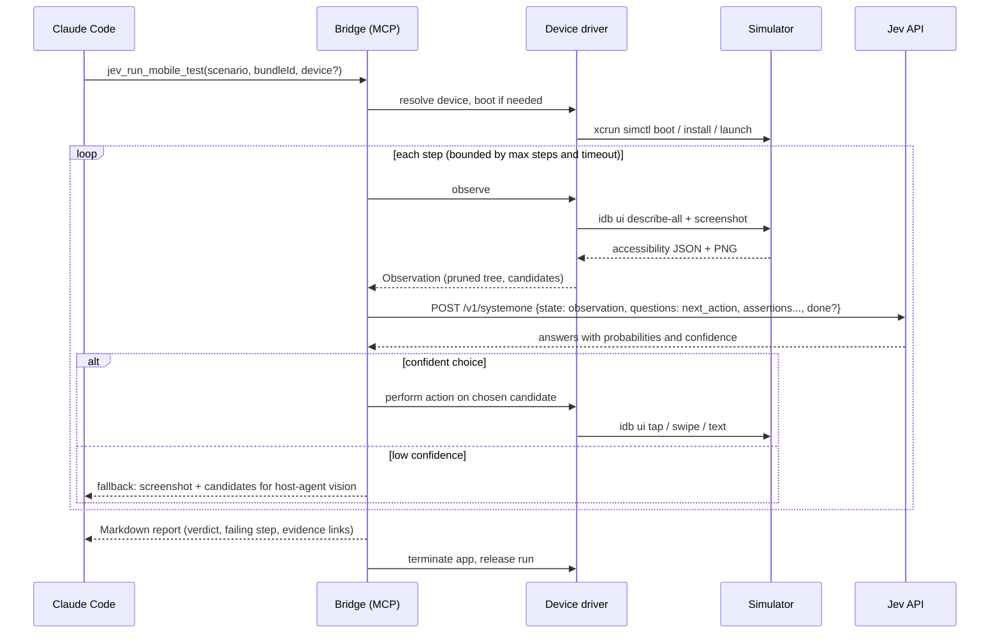

# jev-ios-bridge: architecture blueprint

Bridge between a coding agent (Claude Code, Codex) and an iOS simulator, with Jev (typesafe.ai) supplying per-step decisions. See `CONTEXT.md` for vocabulary and `docs/adr/0001` for why Jev decides but never acts.

## Daily-driver flow



## One run, in sequence



## What each party owns

| Party | Owns | Never does |
| --- | --- | --- |
| Host agent | deciding to verify, reading the report, fixing code, vision fallback | touching the simulator |
| Bridge | run lifecycle, perception, candidates, actions, timeouts, cleanup, report | choosing an action on its own |
| Jev | per-step judgments: next action, assertion checks, progress | seeing pixels, holding state, acting |
| Device driver | simctl and idb commands, screenshots, accessibility dumps | anything Jev-related |

## Project structure (target)

```
jev-ios-bridge/
├── package.json                  # bin: jev-ios-bridge
├── tsconfig.json
├── .env.example                  # TYPESAFE_API_KEY=
├── CONTEXT.md                    # glossary
├── docs/
│   ├── architecture.md           # this file
│   ├── adr/
│   └── agents/
├── src/
│   ├── index.ts                  # CLI entry: `serve` (MCP stdio) | `run` | `devices`
│   ├── config.ts                 # env, .env, timeouts, thresholds
│   ├── mcp-server/
│   │   ├── server.ts             # McpServer over stdio
│   │   └── tools/
│   │       ├── run-mobile-test.ts    # jev_run_mobile_test
│   │       ├── inspect-device.ts     # jev_inspect_device_state
│   │       └── get-report.ts         # jev_get_test_report
│   ├── device-manager/
│   │   ├── driver.ts             # DeviceDriver interface
│   │   ├── simctl.ts             # list / boot / install / launch / terminate
│   │   ├── idb.ts                # describe-all / tap / swipe / text / screenshot
│   │   └── observation.ts        # accessibility JSON -> Observation + candidates
│   ├── jev-client/
│   │   ├── client.ts             # @typesafe-ai/sdk wrapper, retries
│   │   └── questions.ts          # next_action (Choice), assertion (Noul), progress (Score)
│   ├── run/
│   │   ├── run.ts                # step loop, bounds, interruption
│   │   ├── scenario.ts           # scenario + assertion parsing
│   │   ├── policy.ts             # confidence thresholds, fallback, stop rules
│   │   └── artifacts.ts          # per-run dir: steps, screenshots, jev payloads
│   └── report/
│       └── markdown.ts           # token-efficient report
├── claude/
│   ├── commands/test-ios.md      # /test-ios slash command
│   └── hooks/verify-ios.sh       # optional Stop / pre-commit hook
├── test/
└── .scratch/jev-ios-bridge/      # wayfinder map and tickets
```

## Configuration and safety

- `TYPESAFE_API_KEY` from env or `.env`; `TYPESAFE_JEV_API_KEY` accepted as an alias.
- Every run has a wall-clock timeout and a max step count.
- SIGINT and SIGTERM terminate the app under test, flush artifacts, and emit an inconclusive report.
- Screenshots and Jev payloads are written per run for post-mortem, and linked from the report rather than inlined.
