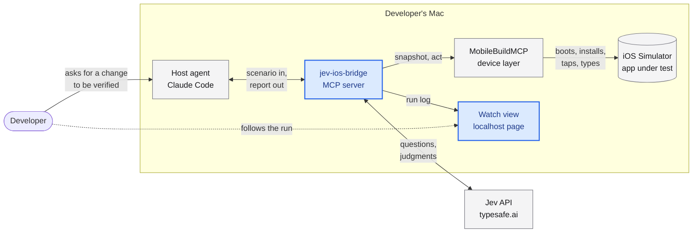
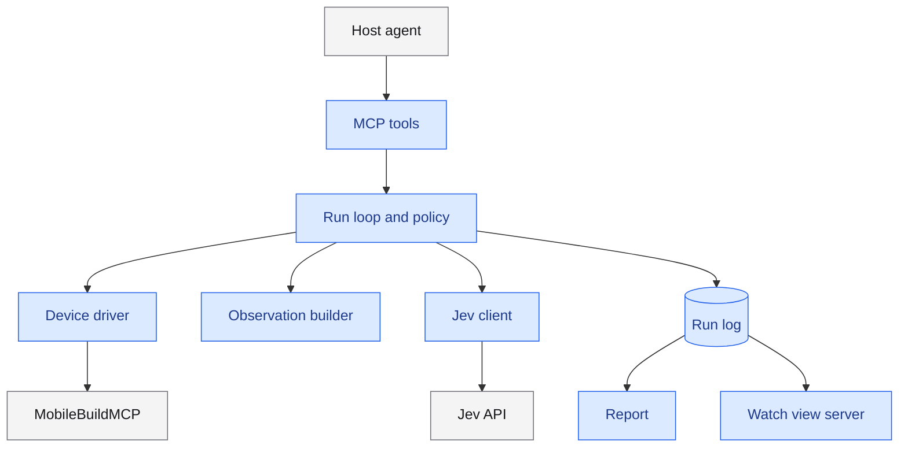
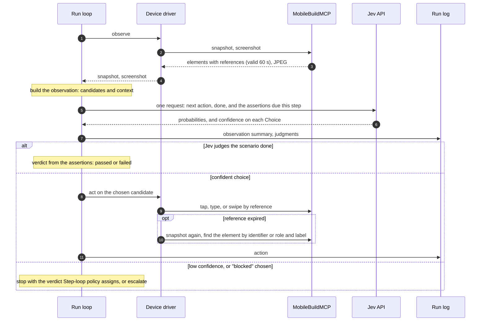
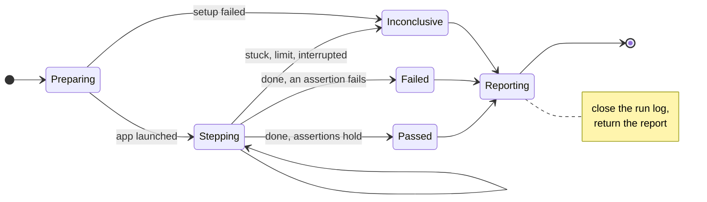

# jev-ios-bridge: architecture

Status: proposed, 2026-09-24. Nothing here is built. Where a detail is still open, this page names the ticket that decides it.

- For the vocabulary, see [`CONTEXT.md`](../CONTEXT.md).
- [ADR-0001](adr/0001-bridge-perceives-and-acts-jev-decides.md) explains why the bridge owns the loop.
- [ADR-0002](adr/0002-mobilebuildmcp-as-device-layer.md) explains why the bridge contains no device code.

The whole design depends on one assumption: that Jev can choose the next action on a real screen. [Feasibility plan](../.scratch/jev-ios-bridge/issues/07-feasibility-plan.md) and [Feasibility run](../.scratch/jev-ios-bridge/issues/08-feasibility-run.md) test that assumption first. If it fails, this page gets rewritten.

## Context

The host agent submits a scenario and reads the report once the run ends. It never sees the screens step by step. [Tool surface](../.scratch/jev-ios-bridge/issues/15-tool-surface.md) decides whether that is one blocking tool call, or a start call followed by status polls.

Data leaves the machine in two places:

- **To TypeSafe.** The observation text and the questions, which means the text shown on the app's screen, plus any values the scenario types into the app.
- **To the host model's provider.** The scenario and the report, like everything else the host agent reads.

MobileBuildMCP's error reporting to Sentry is switched off. [Run log](../.scratch/jev-ios-bridge/issues/13-run-log.md) decides what is redacted before anything is sent.

| Party | Owns | Never does |
| --- | --- | --- |
| Host agent | Choosing to verify, writing or picking the scenario, reading the report, fixing the code | Touching the simulator during a run |
| Bridge | The run: perception, candidates, actions, policy, timeouts, cleanup, run log, report | Choosing an action without a judgment from Jev |
| Jev | Per-step judgments: next action, assertion checks, whether the scenario is done | Seeing images, holding state, acting |
| MobileBuildMCP | Simulators, build, install, launch, snapshots, screenshots, taps, typing | Deciding anything |

## Inside the bridge

Blue boxes are the bridge's own modules; grey boxes are outside it. One ticket settles the shape of each module:

| Module | Job | Decided in |
| --- | --- | --- |
| MCP tools | The tools the host agent calls, their inputs, and what they return | [Tool surface](../.scratch/jev-ios-bridge/issues/15-tool-surface.md) |
| Run loop and policy | Steps, step and time limits, confidence thresholds, stop rules, escalation | [Step-loop policy](../.scratch/jev-ios-bridge/issues/11-step-loop-policy.md) |
| Device driver | The only code that talks to MobileBuildMCP. Finds an element again when its reference has expired. | [Device driver](../.scratch/jev-ios-bridge/issues/12-device-driver.md) |
| Observation builder | Turns a snapshot into candidates and context that fit Jev's budget | [Observation schema](../.scratch/jev-ios-bridge/issues/09-observation-schema.md) |
| Jev client | Sends the step's questions and returns judgments, through `@typesafe-ai/sdk`, which already retries | [Feasibility plan](../.scratch/jev-ios-bridge/issues/07-feasibility-plan.md) |
| Run log | The ordered record of a run. The only source for the report and the watch view. | [Run log](../.scratch/jev-ios-bridge/issues/13-run-log.md) |
| Report | What the host agent reads when the run ends | [Tool surface](../.scratch/jev-ios-bridge/issues/15-tool-surface.md) |
| Watch view server | A localhost page that follows the run log while the run is in progress | [Watch view](../.scratch/jev-ios-bridge/issues/14-watch-view.md) |

## One step

All of a step's questions go to Jev in one request.

- **Questions are answered independently.** The "done" judgment cannot see the action choice.
- **Confidence exists only on Choices.** Choice answers carry a confidence value and Noul answers do not, so the policy needs two kinds of threshold.
- **The step's content is still open.** Feasibility plan fixes the exact question set. Step-loop policy decides which assertions are due at each step.
- **Escalation is not drawn as a working path.** A tool call cannot ask the host agent anything mid-call. If v1 escalates, the run has to stop and resume in a second tool call.

## A run's lifecycle

The transitions shown are defaults.

- [Step-loop policy](../.scratch/jev-ios-bridge/issues/11-step-loop-policy.md) sets the actual stop rules. That includes whether a "blocked" judgment means the app has a bug (Failed) or that the bridge could not tell (Inconclusive).
- [Device driver](../.scratch/jev-ios-bridge/issues/12-device-driver.md) decides what happens to the app under test when a run ends or is interrupted.

## Limits that shape the design

| Limit | Value | Source |
| --- | --- | --- |
| Jev request size | 64k tokens per request; 32k for the state plus the longest question | [Jev](research/jev-model-and-api.md) |
| Jev Choice size | At most 255 options, including any "none" or "blocked" option | [Jev](research/jev-model-and-api.md) |
| Jev price and rate | $0.042 per million input tokens, output free. 1,200 requests per minute and 250k tokens per second, subject to change. | [Jev](research/jev-model-and-api.md) |
| Element reference | Valid for 60 s, in one process, until the next action | [MobileBuildMCP](research/mobilebuildmcp-simulator-and-device.md) |
| Snapshot size | Compact: at most 64 targets, about 600 tokens for the Home screen. Full: about 13,200 tokens minified, CLI only. | [MobileBuildMCP](research/mobilebuildmcp-simulator-and-device.md) |
| Screenshot | JPEG, at most 800 px on the longest side | [MobileBuildMCP](research/mobilebuildmcp-simulator-and-device.md) |
| Typing | US-keyboard characters only | [MobileBuildMCP](research/mobilebuildmcp-simulator-and-device.md) |
| Claude Code, long calls | A tool call still running after 2 minutes moves to the background | [Claude and Jev](research/claude-and-jev-integration.md) |
| Claude Code, large results | Warns above 10k tokens. Above 25k, saves the result to a file and gives the model the path. | [Claude and Jev](research/claude-and-jev-integration.md) |
| Claude Code and Codex, results | When a tool returns `structuredContent`, the model sees only that, not the text blocks | [Claude and Jev](research/claude-and-jev-integration.md) |
| Codex | 60 s default tool timeout, unless the user raises `tool_timeout_sec`. No progress display. | [Claude and Jev](research/claude-and-jev-integration.md) |
| MCP logging | Deprecated in spec 2026-07-28, and neither host displays it | [Watching a run](research/human-watch-panel.md) |

## Configuration and safety

- **The Jev API key** comes from `TYPESAFE_API_KEY`, set in the environment or in `.env`. It is the only key variable the SDK reads, and `.env` is gitignored.
- **MobileBuildMCP is pinned** at `mobilebuildmcp@2.7.1`. Project defaults live in `.mobilebuildmcp/config.yaml`.
- **Every run has a wall-clock timeout and a maximum step count.** [Step-loop policy](../.scratch/jev-ios-bridge/issues/11-step-loop-policy.md) sets the values.
- **Interruption is still open.** A killed stdio server has no open call to return a report to. [Step-loop policy](../.scratch/jev-ios-bridge/issues/11-step-loop-policy.md) decides what an interrupted run records and how the host learns the outcome. [Device driver](../.scratch/jev-ios-bridge/issues/12-device-driver.md) decides what happens to the app under test.
- **Typed values reach Jev and the artifacts.** Anything typed into the app, passwords included, is part of the state sent to Jev, and can end up in artifacts and debug logs. [Run log](../.scratch/jev-ios-bridge/issues/13-run-log.md) decides what is redacted and what is stored.
