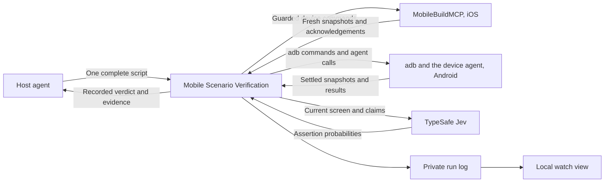

# jev-ios-bridge architecture

The bridge executes an authored script and asks Jev only to judge assertions. The assertion, real-execution, and installed-host gates passed; hardening, measurements and code review are complete, with the documented experimental limits. [ADR-0003](adr/0003-explicit-scripts-with-jev-assertions.md) records the change after three autonomous-action experiments failed.

## Context and authority

```mermaid
flowchart LR
    Host[Host agent] -->|One complete script| Bridge[Mobile Scenario Verification]
    Bridge -->|Guarded device commands| Device[MobileBuildMCP, iOS]
    Device -->|Fresh snapshots and acknowledgements| Bridge
    Bridge -->|adb commands and agent calls| Android[adb and the device agent, Android]
    Android -->|Settled snapshots and results| Bridge
    Bridge -->|Current screen and claims| Jev[TypeSafe Jev]
    Jev -->|Assertion probabilities| Bridge
    Bridge -->|Recorded verdict and evidence| Host
    Bridge --> Log[Private run log]
    Log --> Watch[Local watch view]
```

The run policy owns the verdict. Jev supplies probabilities; the device layer supplies captures and action results. The report and watch view present the recorded result. [Domain boundaries](domain-boundaries.md) keeps these responsibilities inside one context.

## One run

1. Validate the complete script, limits and credentials. Allocate a run log and acquire the dedicated device lease.
2. Restart the installed app through the pinned device layer. The simulator or Android device is already booted; persistent data is a setup precondition. On Android, preparation first checks the device (API level, boot, the app installed, the screen), refuses a foreign agent, and starts the bridge's own copy of the device agent.
3. Capture the current screen before each step (on Android, a settled snapshot of two matching captures, or after 3 seconds the last capture, marked screen still changing). Check distinguishing guards and resolve exactly one eligible target for an action. A missing, ambiguous, or unexpected state stops inconclusively.
4. Execute authored tap, text replacement or swipe actions, or poll a bounded wait. Use current references and require terminal acknowledgements. Fresh references never justify guessing after a changed screen.
5. At a checkpoint, project the current full accessibility capture and ask one Noul per claim. There is no Choice, completion question, future script, or value dictionary in the request.
6. Record the checkpoint result. Any confidently false claim (probability at or below 0.1) fails it, even beside uncertain claims ([ADR-0004](adr/0004-fixed-assertion-bounds-single-judgment.md)); otherwise any uncertain claim yields inconclusive. Passing requires all steps and checkpoints, followed by successful cleanup.
7. Stop the app, release the device lease, and append the final verdict. When the lease is released, nothing the run started can still act on the device. Until that can be shown (an unknown device outcome, a cleanup failure), the run keeps the lease, which prevents a pass, and releases it late once it can.

The script has finite steps and global time/step budgets. It does not escalate to the host or resume an interrupted run. The host polls progress with bounded waits; running responses contain no screen evidence for selecting another action.

## Modules

| Module | Responsibility |
| --- | --- |
| `src/scripted/schema` | Strict scenario, guard, selector, value and step validation |
| `src/scripted/select` | Unique eligible target resolution and guard checks |
| `src/scripted/run` | Ordered execution, limits, checkpoint policy and cleanup |
| `src/scripted/observe`, `jev` | Frozen assertion projection, pinned SDK request and response validation |
| `src/device` | The driver factory, the shared device lease (`lease.ts`), and MobileBuildMCP commands, references and acknowledged lifecycle |
| `src/device/android` | The Android driver: the `adb` runner, the pinned device agent's supply and client, element mapping, the settle rule, `logcat` streams and the app-exit watch |
| `src/capture` | The Android `capture` command: one settled screen under the device lease, without launching the app |
| `src/logpane` | The live log pane and `logs`, following the app's own output on either platform |
| `src/log`, `src/scripted/report`, `src/watch` | Private evidence, report reconstruction and human viewing |
| `src/service`, `src/mcp`, `src/cli` | Job lifetime and public entrypoints |

Historical autonomous modules and experiments are retained for evidence and replay. The supported service/CLI/MCP path accepts scripts only.

## The device lease and the Android device agent

Both drivers take the same device lease, keyed by the device identity: a simulator's UDID, an emulator's AVD name, or a phone's serial. The lease file records the holder and, on Android, what the run started that could outlive it (the device agent, its `adb forward`, the `logcat` streams). The lease is released only when nothing the run started can still act on the device; on Android, stopping the agent, confirmed, is that fence. A crashed run's lease passes to the next run, which sweeps only the bridge's own leftovers.

The Android driver never runs mobilecli. It copies mobilecli's device agent out of the pinned package, checks it against a pinned SHA-256, pushes it to its own path on the device, and talks to it through a forwarded local socket. Any other UI-automation agent on the device is foreign: the run is refused with `DEVICE_BUSY`, and the foreign agent is left alone. [ADR-0006](adr/0006-mobilecli-device-agent-as-android-device-layer.md) records the decision.

## Identity and evidence

Selectors use durable descriptions rather than captured element refs. Generic matching is conservative. An internal MobileBuildMCP 2.7.1 opt-in recognizes exact-frame button aliases only where the pinned vendor generates identical tap commands; it does not extend to different positions or other actions. [The proof](../spikes/scripted/integration/tap-alias-equivalence.json) records this boundary.

TypeSafe receives visible screen text and current claims. Supplied values go to device actions and may subsequently appear in that text. Screenshots remain local. The journal redacts supplied values and the API key; image contents are not text-redacted. The watch view binds to localhost and requires its access token.

The run log stores decisive assertion observations and copied screenshots. Reports include claims, probabilities, semantic screen evidence and local pointers. Their text is bounded and marks truncation; complete local evidence remains available. An incomplete final JSONL record can be recovered, but an absent final verdict remains inconclusive.

## Validated limits

- Node 24+, pinned MobileBuildMCP 2.7.1, mobilecli 1.0.14 (its device agent only), Jev 1.13.0 and SDK 0.6.0.
- iOS simulators, and Android 12 (API 31) or later on emulators and (untested) phones; build/install/seed/reset are outside the bridge.
- At most 100 authored steps; default whole-run time 300 seconds, configurable up to one hour. Each wait is at most 60 seconds.
- Fixed Noul yes/no bounds 0.9/0.1. Uncertainty is visible and never promoted to a pass.
- Full observation cap 24,000 bytes; state plus longest question 28,000 bytes; total request 56,000 bytes. Overflow stops rather than silently removing evidence.
- On iOS, printable US-keyboard literals, with no leading hyphen under the pinned typing limitation. On Android, any text except control characters; non-ASCII text goes through the device clipboard.

See the [guide](guide/README.md) for setup and use, and the v0.1.0 [tracker](../.scratch/jev-ios-bridge/map.md) and [release plan](../.scratch/jev-ios-bridge/release-plan.md) for that release's evidence and verification. The v1.0.0 plan is the [release spec](../.scratch/v1-release/release-spec.md), and the v1.2.0 Android plan is its [own release spec](../.scratch/android-support/release-spec.md), with the [domain model](../.scratch/android-support/domain-model.md).
