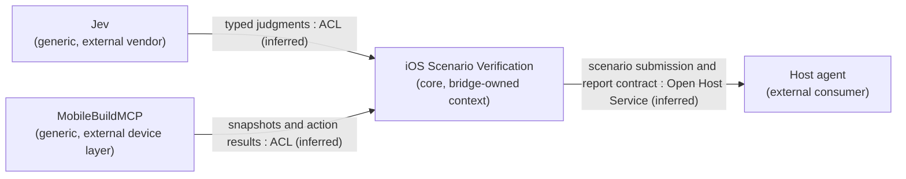

# Domain boundaries

This map describes the target design agreed with the owner in a two-round DDD session on 2026-09-24. The bridge is not implemented. Its feasibility gate and both proposed ADRs retain their existing status.

## Purpose and ownership

The core domain is executing iOS scenarios and returning evidence-backed verdicts. Cheap execution supports that purpose. The host agent must receive enough evidence to continue work or investigate a failure without supervising every step.

One bounded context, **iOS Scenario Verification**, owns the scenario, run, step, observation, candidate, interpretation of judgments, action policy, verdict, and evidence. These terms retain their definitions in [CONTEXT.md](../CONTEXT.md).

| Capability | Classification | Ownership |
| --- | --- | --- |
| Execute scenarios and justify verdicts | Core | The bridge owns the run and verification policy |
| Prepare the app and coordinate device access | Supporting | Modules within the verification context, using the external device layer |
| Store and present evidence in reports and watch views | Supporting | Modules within the verification context; sufficient evidence to justify a verdict remains a core responsibility |
| Supply judgments, device automation, and MCP transport | External services or generic infrastructure | Jev, MobileBuildMCP, and the MCP implementation supply these capabilities |

The bridge's verification policy owns the verdict. Jev supplies judgments. The device layer supplies captures and action results. Reports and watch views present the recorded outcome without recomputing it. An unsuccessful tap supplies execution evidence; the policy decides whether it warrants failed or inconclusive. The exact rules remain open.

These capabilities share one language and serve one workflow. Separate modules are sufficient for the current scope. Revisit the context boundary if preparation, reporting, or watching must become independently usable products.

## Context map

The bridge is the only owned bounded context. External boxes show the suppliers and consumer at its boundary; their internal bounded contexts are outside this model. Arrow direction denotes upstream model influence, not request order. Relationship labels are inferred from the existing proposed architecture, not separately confirmed integration decisions.

An ACL, or anti-corruption layer, translates a supplier's model into the bridge's language. It does not require a separate service.

| Boundary | What crosses it | Basis for the inferred relationship |
| --- | --- | --- |
| Jev and bridge | Observation state and typed questions go out; judgments come back | The bridge interprets vendor answer types under its own policy. Jev does not own the verdict. See [architecture](architecture.md#one-step) |
| Device layer and bridge | Device requests go out; snapshots, screenshots, action results, and log pointers come back | The device driver isolates vendor details, including temporary element references. See [ADR-0002](adr/0002-mobilebuildmcp-as-device-layer.md) |
| Bridge and host agent | The host submits a scenario; the bridge returns a report with verdict and evidence | The bridge defines a common tool contract for hosts to consume. Exact schemas and call patterns remain with [Tool surface](../.scratch/jev-ios-bridge/issues/15-tool-surface.md) |

The run log, report, and watch view stay inside the verification context. Their data flow does not establish another bounded context or imply event sourcing. The app under test and device are the objects being exercised through the device layer; this map does not model the app's own business domain.

## Coverage

**Settled by the owner:** verification as the core domain; preparation and presentation as supporting capabilities; one owned bounded context; verdict authority in the bridge's policy; reports and watch views presenting that outcome.

**Inferred:** the integration patterns above, based on planned interfaces and existing ADRs. This strategic pass names them from exchanged data, without settled domain events or implemented contracts. Supplier APIs are not revalidated by this session.

**Outside this pass:** detailed language changes, aggregates, entities versus values, consistency invariants, domain events, and event schemas. The existing glossary remains the source of terms; no aggregate or event model was approved.

**Still open:** assertion timing; failed versus inconclusive rules; escalation and resumption; preparation's place in a run's lifecycle; observation freshness and candidate matching; device concurrency and cleanup; redaction; and concrete transport and tool schemas. Existing [planning tickets](../.scratch/jev-ios-bridge/map.md) retain these decisions and their feasibility dependencies.

The next evidence gate is [Feasibility plan](../.scratch/jev-ios-bridge/issues/07-feasibility-plan.md), followed by [Feasibility run](../.scratch/jev-ios-bridge/issues/08-feasibility-run.md). This boundary agreement does not establish that Jev can carry a run.
