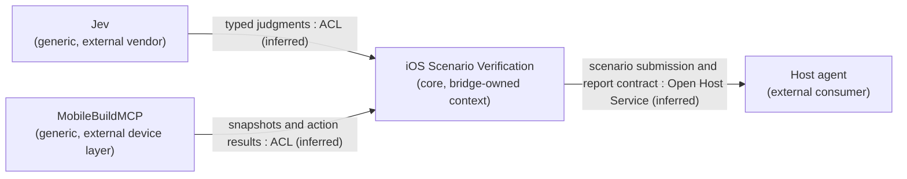

# Domain boundaries

The owner agreed this single-context boundary in a two-round DDD session on 2026-09-24. After three autonomous-action no-go results, the owner approved evaluating explicit scripts. The assertion and real-execution gates passed; production integration follows [ADR-0003](adr/0003-explicit-scripts-with-jev-assertions.md). The strategic boundary is unchanged.

## Purpose and ownership

The core domain is executing iOS scenarios and returning evidence-backed verdicts. Cheap execution supports that purpose. The host agent must receive enough evidence to continue work or investigate a failure without supervising every step.

One bounded context, **iOS Scenario Verification**, owns the scenario, script, guard, selector, run, observation, interpretation of judgments, action policy, verdict, and evidence. These terms retain their definitions in [CONTEXT.md](../CONTEXT.md).

| Capability | Classification | Ownership |
| --- | --- | --- |
| Execute scenarios and justify verdicts | Core | The bridge owns the run and verification policy |
| Prepare the app and coordinate device access | Supporting | Modules within the verification context, using the external device layer |
| Store and present evidence in reports and watch views | Supporting | Modules within the verification context; sufficient evidence to justify a verdict remains a core responsibility |
| Supply judgments, device automation, and MCP transport | External services or generic infrastructure | Jev, MobileBuildMCP, and the MCP implementation supply these capabilities |

The bridge's verification policy owns the verdict. Jev supplies judgments. The device layer supplies captures and action results. Reports and watch views present the recorded outcome without recomputing it. An unsuccessful tap supplies execution evidence; the policy decides whether it warrants failed or inconclusive. The scripted policy distinguishes false assertions from uncertain judgments and execution failures; see [Step-loop policy](../.scratch/jev-ios-bridge/issues/11-step-loop-policy.md).

These capabilities share one language and serve one workflow. Separate modules are sufficient for the current scope. Revisit the context boundary if preparation, reporting, or watching must become independently usable products.

## Context map

The bridge is the only owned bounded context. External boxes show the suppliers and consumer at its boundary; their internal bounded contexts are outside this model. Arrow direction denotes upstream model influence, not request order. Relationship labels remain strategic interpretations of the implemented adapter boundaries, not separately negotiated vendor relationships.

An ACL, or anti-corruption layer, translates a supplier's model into the bridge's language. It does not require a separate service.

| Boundary | What crosses it | Basis for the inferred relationship |
| --- | --- | --- |
| Jev and bridge | Observation state and typed questions go out; judgments come back | The bridge interprets vendor answer types under its own policy. Jev does not own the verdict. See [architecture](architecture.md) |
| Device layer and bridge | Device requests go out; snapshots, screenshots, action results, and log pointers come back | The device driver isolates vendor details, including temporary element references. See [ADR-0002](adr/0002-mobilebuildmcp-as-device-layer.md) |
| Bridge and host agent | The host submits a scenario; the bridge returns a report with verdict and evidence | The bridge defines a common tool contract for hosts to consume. Schemas and call patterns are recorded in [Tool surface](../.scratch/jev-ios-bridge/issues/15-tool-surface.md) |

The run log, report, and watch view stay inside the verification context. Their data flow does not establish another bounded context or imply event sourcing. The app under test and device are the objects being exercised through the device layer; this map does not model the app's own business domain.

## Coverage

**Settled by the owner:** verification as the core domain; preparation and presentation as supporting capabilities; one owned bounded context; verdict authority in the bridge's policy; reports and watch views presenting that outcome.

**Inferred:** the integration patterns above describe model translation at the adapters. They do not imply separate services or vendor agreements.

**Tactical model:** a Run owns ordered progress, checkpoint proofs, cancellation state, and its final verdict. The authored Scenario/Script is an immutable input to that run; selectors, guards, assertions and typed values describe its work. A snapshot/reference belongs to one captured state, not durable app identity. The run log records execution facts; this is not a claim of transactional event sourcing across an external device.

**Consistency limits:** the bridge can serialize a device lease and append evidence, but cannot atomically commit a UI action and a log record. Unknown acknowledgements stop execution and retain the lease rather than retrying a possibly applied action. Reports never infer a pass from an interrupted journal.

**Recorded run facts:** preparation, observations, acknowledged actions, assertion judgments, checkpoint outcomes, errors, and a final policy verdict. They remain inside this context; no published domain-event integration is introduced.

**Release evidence:** the installed-host path, comparative measurements, code review and clean-package checks are complete. Publication verification is recorded in the release plan. Earlier failed experiments remain preserved and do not establish autonomous navigation.
